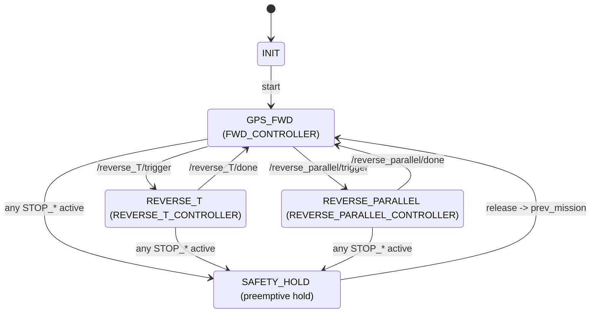

# Mandol_ws — ROS 2 자율주행

ROS 2 Humble 기반의 자율주행 실차/시뮬레이션을 위한 작업공간으로, GPS/RTK 기반 로컬라이제이션, 경로계획, 비전 인지, 미션 판단, 차량 구동까지 전체 파이프라인을 모듈화했습니다.

**핵심 가치**
- 안전 선점(Safety preemption)과 미션 전이를 분리한 2계층 상태기계 설계
- 인지/계획/제어 패키지와의 느슨한 결합을 통한 손쉬운 통합
- 실제 대회 트랙과 시나리오에 맞춘 실전형 토픽/파라미터 설계

**구성 개요**
- 센서: u-blox F9P/F9R, USB 카메라, RealSense 등
- 로컬라이제이션/맵: `gps_to_utm` (UTM 변환, TF, CSV 맵 퍼블리시)
- 경로계획/조향: `path_planning` (ROI 경로, Pure Pursuit, 미션 트리거)
- 인지: `mando_vision` (신호등/장애물 인지 → 정지 신호)
- 미션 판단: `mission_supervisor` (미션/안전 상태 결정, 스로틀 게이팅)
- 액추에이션: `serial_bridge` (스로틀/조향 시리얼 전송)

---

## mission_supervisor

미션 레이어와 세이프티 레이어를 분리한 선점형 상태기계 노드입니다. 안전 신호가 활성화되면 어떤 미션 상태에서도 즉시 선점하고, 해제 조건을 만족하면 이전 미션으로 자연스럽게 복귀합니다.

- 노드: `mission_supervisor_node`

**상태 구조**
- 미션 상태(`MissionState`): `INIT` → `GPS_FWD` ↔ `REVERSE_T` ↔ `REVERSE_PARALLEL`
- 안전 상태(`SafetyStatus`): `SAFE_OK`, `STOP_SLOPE`, `STOP_OBSTACLE`, `STOP_TRAFFIC`

**구독 토픽 (입력)**
- `/slope_stop` (`Bool`): 경사로 정지 신호
- `/traffic_stop` (`Bool`): 신호등 정지 신호
- `/intersection` (`Bool`): 교차로 진입 여부 (신호등 정지 유효화)
- `/obstacle_existance` (`Bool`): 장애물 존재 신호
- `/reverse_T/trigger`, `/reverse_T/done` (`Bool`): T자 후진 시작/완료
- `/reverse_parallel/trigger`, `/reverse_parallel/done` (`Bool`): 평행 주차 시작/완료
- `/throttle_from_planning` (`Float32`): 경로계획(예: Pure Pursuit)에서 제안한 스로틀

**퍼블리시 토픽 (출력)**
- `/throttle_cmd` (`Float32`, 기본): 미션/안전 로직이 게이팅한 최종 스로틀 명령
- `/mission_state` (`String`): 현재 미션 상태
- `/active_algorithm` (`String`): 활성화된 하위 알고리즘
- `/safety_status` (`String`): 현재 안전 상태
- `/safety_active` (`Bool`): 안전 선점 활성화 여부

### 🛡️ Safety Layer (Preemptive Hold)

> 어떤 미션 상태에서도 STOP 신호가 들어오면 **세이프티가 선점**하여 정지/저속 유지 후, 해제 시 **직전 미션으로 복귀**합니다.

| 신호/상태 | 발동 조건 | 우선순위 | 홀드 중 액션 | 해제 조건(유지 포함) | 해제 후 동작 |
|---|---|---|---|---|---|
| **SAFE_OK** | 모든 `STOP_* == false` | — | 선점 없음 | — | 이전 미션 유지 |
| **STOP_SLOPE** | `slope_stop == true` | 1 | `throttle = 0.15` (경사 보정) 또는 안전 정지 | **최소 5 s 유지** + 신호 `false` 안정화(히스테리시스) | **직전 미션**으로 복귀 |
| **STOP_OBSTACLE** | `obstacle_existance == true` | 2 | `throttle = 0` (정지) | **최소 5 s 유지** + 신호 `false` | 이전 미션으로 복귀 |
| **STOP_TRAFFIC** | `traffic_stop == true` **AND** `intersection == true` | 3 | `throttle = 0` (정지) | 신호 해제 + 히스테리시스 | 이전 미션으로 복귀 |

> Safety Layer

### 🚦Misson Layer
> INIT에서 시작해 기본 주행(GPS_FWD)을 수행하며, 트리거가 오면 REVERSE_T / REVERSE_PARALLEL로 전환되고 완료 시 GPS_FWD로 복귀합니다. 어느 시점이든 STOP_* 발생 시 SAFETY_HOLD가 선점해 상태 진행을 멈추고, 해제되면 직전 미션으로 되돌아갑니다.

| 상태                        | 진입 트리거                       | 활성 컨트롤러 / 주요 동작                             | 종료·전이 트리거                                                                                   | 비고                             |
| ------------------------- | ---------------------------- | ------------------------------------------- | ------------------------------------------------------------------------------------------- | ------------------------------ |
| **INIT**                  | 노드 시작                        | 초기화, 파라미터 로드                                | 자동 전이 -> **GPS_FWD**                                                                        | 시작 상태                          |
| **GPS_FWD**               | INIT 종료 또는 SAFETY_HOLD 해제 복귀 | **FWD_CONTROLLER** 활성, 전진 경로/속도 추종          | `/reverse_T/trigger` -> **REVERSE_T** / `/reverse_parallel/trigger` -> **REVERSE_PARALLEL** | STOP_* 발생 시 **SAFETY_HOLD** 선점 |
| **REVERSE_T**             | `/reverse_T/trigger`         | **REVERSE_T_CONTROLLER** 활성(T자 후진 시퀀스)      | `/reverse_T/done` -> **GPS_FWD**                                                            | STOP_* 시 **SAFETY_HOLD**       |
| **REVERSE_PARALLEL**      | `/reverse_parallel/trigger`  | **REVERSE_PARALLEL_CONTROLLER** 활성(평행주차 후진) | `/reverse_parallel/done` -> **GPS_FWD**                                                     | STOP_* 시 **SAFETY_HOLD**       |
| **SAFETY_HOLD** *(선점 상태)* | 어떤 상태에서든 `STOP_* == true`    | 출력은 정지/저속 홀드, 활성 알고리즘은 유지                   | STOP_* 해제 + 히스테리시스 충족 -> **직전 상태 복귀**                                                       | 상태 진행 없음(선점 전용)                |

> mission layer

**시나리오 예시**
- 교차로 내 신호등 정지 활성 → 즉시 정지, 해제 히스테리시스 후 복귀
- 경사로 정지 활성 → 5초 유지 후 복귀(같은 세션 재선점 방지)
- T자/평행 주차 트리거 → 후진 미션 진입, 완료 신호로 `GPS_FWD` 복귀

---

## 주요 패키지 요약

- `gps_to_utm` (C++/Python)
  - 기능: GPS Fix → UTM 변환(`f9r_to_utm`, `f9p_to_utm`), 방위각 계산, CSV 경로 TF/시각화(`tf_gps_csv_node`), bag→CSV 유틸리티
  - 메시지/의존: `rclcpp`, `nav_msgs`, `geometry_msgs`, `tf2_ros`, `rosbag2_*`

- `path_planning` (C++)
  - 기능: ROI 경로 생성(`f9r_roi_path`), Pure Pursuit(`pure_pursuit_node`)로 `/auto_steer_angle`, `/throttle_from_planning` 산출, CSV 영역 기반 미션 트리거 발행
  - 인터페이스: `/slope_stop`, `/intersection`, `/reverse_*` 트리거/완료, `/throttle_from_planning`

- `mando_vision` (Python)
  - 기능: 신호등/장애물 인지(ONNX 추론) → `/traffic_stop`, `/obstacle_existance` 생성, 시각화 이미지 퍼블리시

- `serial_bridge` (Python)
  - 기능: `/throttle_cmd`, `/auto_steer_angle`를 아두이노로 시리얼 전송 (포트/보드레이트 파라미터화)

- `RTK_GPS_NTRIP`, `usb_cam` (서드파티)
  - 기능: RTK 보정수신/유블럭스 드라이버, USB 카메라 드라이버

---

## 빌드/실행 (요약)

- 요구사항: ROS 2 Humble, colcon, 필요한 ROS 패키지들(각 패키지 `package.xml` 참조)
- 빌드: 작업공간 루트에서 `colcon build` → `source install/setup.bash`
- 예시 실행(핵심): `ros2 run mission_supervisor mission_supervisor_node`

실제 센서/지도/계획 노드의 상세 실행 방법은 각 패키지의 Readme 및 설정 파일(예: `src/path_planning/config/*`, `src/gps_to_utm/config/*`)을 참고하세요. 본 문서는 포트폴리오 목적의 개요를 제공합니다.

---

## 아키텍쳐

- 인지(`mando_vision`) → `/traffic_stop`, `/obstacle_existance`
- 로컬라이제이션/맵(`gps_to_utm`) → UTM/TF/CSV 경로
- 경로계획(`path_planning`) → `/auto_steer_angle`, `/throttle_from_planning`, 미션 트리거
- 미션 판단(`mission_supervisor`) → `/throttle_cmd` 게이팅·상태 퍼블리시
- 액추에이션(`serial_bridge`) → 시리얼로 차량 구동

---

